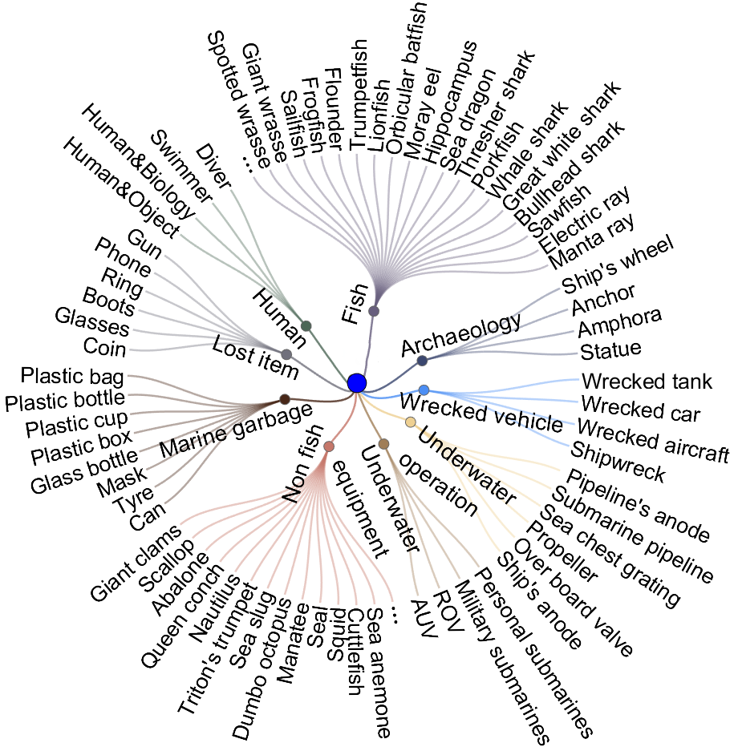

# USIS16K

Source code and dataset for our paper “**USIS16K: High-Quality Dataset for Underwater Salient Instance Segmentation**” by Lin Hong,  Xin Wang, Yihao Li, and Xia Wang. 

Created by **Lin Hong**, email: eelinhong@ust.hk 

## USIS16K dataset
**USIS16K** is a **High-Quality** large-scale dataset consisting of **16,151**  high-resolution underwater images captured from a wide range of real-world marine environments. It encompasses **158**  distinct categories of underwater objects. 
**Salient objects in each image were identified using eye-tracking data**, and subsequently annotated with high-quality instance-level masks.
Google drive: [USIS16K](https://drive.google.com/file/d/1SIfpJe7rpeL6ZsRzD9ir0mRsKRYehjxb/view?usp=drive_link). **USIS16K is free for academic research, not for any commercial purposes**.

Note: for practical training and reliable test results of deep methods on the USIS16K dataset, there should be enough samples of each category on the training set, validation set, and test set. Hence we follow the USIS16K split of roughly 7:2:1.

## Taxonomic System
The construction of the USIS16K dataset emphasized diversity and representativeness of object categories by including 158 common underwater object categories found in natural underwater environments. A hierarchical taxonomic system was adopted to systematically organize these objects


## Benchmark
We retrained 8 object detection methods and 10 instance segmentation models in the MMDetection, as well as the specialized models WaterMask and USIS-SAM, on the USIS16K dataset. 
A qualitative evaluation of the 12 representative methods on USIS tasks is shown.

The retrained models, along with their corresponding predicted saliency maps, will be made publicly available in the near future.

## Bibliography entry
If you think our work is helpful, please cite
```
@ARTICLE{10102831,
  author={Hong, Lin and Wang, Xin and Yihao, Li and Xia, Wang},
  journal={ArXiv}, 
  title={USIS16K: High-Quality Dataset for Underwater Salient Instance Segmentation}, 
  year={2025}}
```

## Acknowledgement
We thank the developer of [MMdetection](https://github.com/open-mmlab/mmdetection), [WaterMask](https://github.com/LiamLian0727/WaterMask), and [USIS-SAM](https://github.com/LiamLian0727/USIS10K) for providing their open-source code, which greatly facilitated our experiments and model development.

## Note to active participants

**USIS aims to jointly address two key challenges in underwater vision: where to look (saliency prediction) and what is there (instance segmentation). We hope USIS16K can facilitate research within the fieds of marine computer vision and marine robotics.** 
