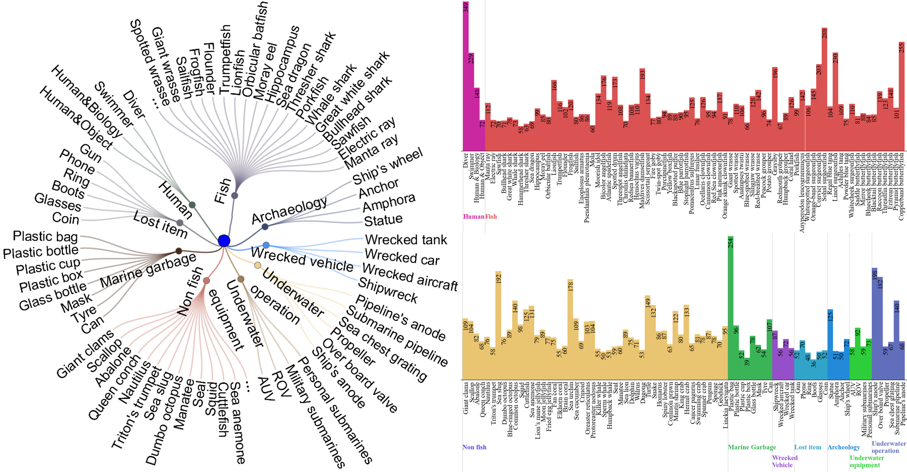

# USIS16K

Source code and dataset for our paper “**USIS16K: High-Quality Dataset for Underwater Salient Instance Segmentation**” by Lin Hong,  Xin Wang, Yihao Li, and Xia Wang. 

Created by **Lin Hong**, email: eelinhong@ust.hk 

## USIS16K dataset
**USIS16K** is a large-scale dataset comprising 16,151 high-resolution underwater images collected from diverse real-world settings, covering 158 categories of underwater objects. The salient objects in each image is identified by Eye-tracker, and then annotated with high-quality instance-level masks.  
Google drive: [USIS16K](https://drive.google.com/file/d/1SIfpJe7rpeL6ZsRzD9ir0mRsKRYehjxb/view?usp=drive_link). **USIS16K is free for academic research, not for any commercial purposes**.

Note: for practical training and reliable test results of deep methods on the USIS16K dataset, there should be enough samples of each category on the training set, validation set, and test set. Hence we follow the USIS16K split of roughly 7:2:1. Its folder looks like this:

## Taxonomic System
The construction of the USIS16K dataset emphasized diversity and representativeness of object categories by including 158 common underwater object categories found in natural underwater environments. A hierarchical taxonomic system was adopted to systematically organize these objects


## Benchmark
We retrained 8 object detection methods and 10 instance segmentation methods in MMDetection, and WaterMask, USIS-SAM on the USIS16K. Here is the qualitative evaluation of the 12 methods on USIS tasks.

Retrained models and the predicted saliency maps will publicly availabe soon.

## Bibliography entry
If you think our work is helpful, please cite
```
@ARTICLE{10102831,
  author={Hong, Lin and Wang, Xin and Yihao, Li and Xia, Wang},
  journal={ArXiv}, 
  title={USIS16K: High-Quality Dataset for Underwater Salient Instance Segmentation}, 
  year={2025}}
```

## Acknowledgement
We thank the [MMdetection](https://github.com/open-mmlab/mmdetection), [WaterMask](https://github.com/LiamLian0727/WaterMask) and [USIS-SAM](https://github.com/LiamLian0727/USIS10K) for provide open source code. 

## Note to active participants

**USIS aims to jointly address the problems of where to look (saliency prediction) and what is there (instance segmentation) in underwater scenarios，which will facilitate the image-gaol navigation and marine robots** !!! 
